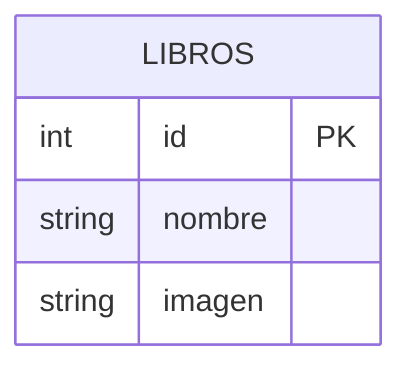

# Tienda Online - Proyecto PHP + MySQL

Proyecto de e-commerce desarrollado en PHP con conexión a base de datos MySQL. Incluye funcionalidades de carrito de compras, registro y login de usuarios, catálogo de productos y envío de correos mediante PHPMailer.

## Funcionalidades

- Registro e inicio de sesión de usuarios
- Catálogo de productos
- Carrito de compras
- Envío de correos de contacto (PHPMailer)
- Panel de administrador

## Tecnologías utilizadas

- PHP
- MySQL
- HTML / CSS
- PHPMailer

## Modelo de base de datos

Base de datos: `sitio`

La tabla `libros` almacena el catálogo de productos. El campo `imagen` guarda únicamente el nombre del archivo (por ejemplo `alien.jpeg`), mientras que las imágenes reales se encuentran en la carpeta `img/` del proyecto.

## Nota

Este proyecto fue subido a GitHub como repositorio estático con fines de portafolio. Al no contar con hosting con soporte PHP/MySQL en vivo, la base de datos no está conectada en esta versión publicada.
